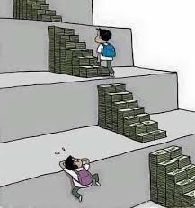

# 关于金融会计等经济领域从业人员学习编程知识的思考

## 经济领域
有一个领域跟钱的关系很大，那就是经济领域。
这里面有很多的细分，如果不区分层级简单列举的话，有很多名词都可以包含进来。
金融，证券，会计，审计，投行，期货，外汇，公司治理等等，都属于经济领域。

## 与编程的关系
随着时代的进步，经济领域出现的数据也越来越多，而计算机天然就是用来处理数据的，所以通过编程让计算机来处理问题就成为了一种趋势。
在经济领域不同细分方向中，从业人员或者研究学者也逐渐接触计算机编程知识，如果能够掌握一门编程语言，将对工作与学习有很大帮助。

## 学习编程的困难
可是，很多人并不是计算机专业的，学习计算机编程有着很多的困难。我根据自己做的很多实际了解，整理了一些常见的原因。
最主要的就是不知道从哪里上手。

### 蜀道难
网上的编程课程其实非常多，但是这些课程都很难上手学习，根本学不进去。内容太抽象，讲课很枯燥，学习周期太长，而且学会之后发现好像除了示例什么也做不了。
其实这种感觉很准确，因为这些课程多数是针对有一定的计算机基础的人设置的，哪怕有些说零基础学会某某某的，也是指某个编程语言的零基础，但是要求对计算机编程理念有一定了解。
因为很多讲师都是计算机专业出身，非常系统地学习了计算机知识，做培训也是按这样的思路来进行的。从第一节就开始讲语法，变量，流程控制，函数，类这些编程基础知识。

### 难于上青天
而金融会计等专业的人对这么一大堆概念其实很难理解。就算硬着头皮听了下去，十多节课后，又发现了新问题。学了很多概念，依然只能做一些示例程序，比如折腾字符串，数组，读写文件。
完全想不明白这些跟自己的金融会计等知识是怎么联系的，课程就变得更枯燥了。更有甚者，学习数据库知识，这种更抽象的数据知识，对于非计算机专业的初学者，是很大的挑战。
就算明白一些库，表，字段的概念，对于联表，聚合等复杂概念就真是一头雾水了。

## 自学能力
以上是很重要的一点，让金融会计等方向的朋友难以上手学编程。其实还有一点，也比较重要，那就是自学能力。

### 自学能力强的好处
我们上学的过程，学会的不只是知识，还有自我学习的能力。比如一个证券从业人员，可能会遇到一些新的证券行业概念或者规则。
因为他从事这个行业有一定时间，对行业了解比较透，所以新的事物也能很容易了解学习到，也许是自己查询，也许是与他人讨论，都是一种自学能力的体现。

其实计算机编程也是一样，我自己就是有着十年多编程经验，对这个圈子了解很多。学习一门新的编程语言或者框架或者库都有着一套方法，表现为检索文档，查看示例，了解概念，熟悉讨论反馈渠道，而且结合已经理解的很多知识与实际例子，可以做到快速上手。

### 自学能力差的不足
但是，一旦脱离自己熟悉的领域，想有自学能力就太困难了。这就是有一些人分明学会了一些编程知识，但是无法做出自己想到的东西，因为还有些问题需要自学解决。
也许表现为程序报错了，不知道如何处理。也许表现为获取了数据，不知道怎么实现自己的分析方法。不了解问题如何寻求帮助，看到帮助后也不一定能理解充分。

自学能力是很多网上的课程都没有注意到的，是影响学习编程很重要的第二点。

## 思考
那么，有没有办法快速一些学会编程知识呢？我认为有，也可以说没有。

### 不可能的事
如果目标是像计算机专业人员那样，对编程有着系统的学习与理解，掌握计算机编程这一通用领域的知识，几乎做不到快速学习。
因为计算机做为一门新兴发展的科学，涉及到的概念与思想抽象而复杂，零基础的人必须有足够多的时间精力学习，再加上大量的实践才能有不错的理解，在某一方向有不错的能力。

举个例子，比如我自己，四年的大学都在学习编程，感觉学的挺不错的，写了很多的程序，C语言，C++,C#,汇编等把课本上的都学地很好。可是工作后才发现，又要从零开始，之前的都是打基础。
当我工作了十年后，越来越觉得自己在计算机领域学习的只是很小很小的一块，也只是能做简单的应用，原理与复杂问题都了解不多。所以，我觉得不可能做到快速学会编程。

### 可能的目标
但是，金融会计等方向的朋友们，并不是非要对着计算机科学死磕，如果能借助编程实现自己想做的事情就够了。有很多事情短时间不了解也不影响。

也许是在现成程序的基础上简单修改逻辑或者参数，也许是自己做一个简单的测试，或者只是为了了解某个地方的流程，还有一些人是为了方便与程序员沟通。

如果把上述事情定做目标的话，我认为是有可能快速学会相关的编程知识的。

## 思路
把我们已经分析的事情扬长避短，可以总结出一些理念。

通过与金融会计相关的知识入手，隐藏掉编程里晦涩的知识，展示编程在具体示例上的思路，逐步增加通用核心而简单的编程概念，配合真实一些的例子进行实践，在这个过程中渐渐展现自学的细节，应该能实现不错的效果。

虽然无法做到几天学会某某编程语言，这样的方法应该是很平滑也是很对接近上手目标的。

## 尝试
最近，我已经找了十多个金融会计从业或者学生进行了一些课程的尝试，效果还是很不错的。

这里也提一点，python是一门比较适合的编程语言，上手难度比较低，如果你是经济领域的从业人员或者学习，想要学习python（以后我也会培训R matlab stata等），可以私信联系我。

我正在准备一系列的免费课程，会不断发出来，也提供一对一的针对教学，希望能帮助到你。

## 宣传一下
- [https://conybcc.github.io/](https://conybcc.github.io/) 这是我的github博客（会不断更新免费课程）
- [http://www.gonggaotong.net/](http://www.gonggaotong.net/) 公告通 这是我的工作室开发一款工具，可以检索与分析上市公司公告，还有下载器可以检索并下载公告

## 我的联系方式
- 知乎：可白
- 微信：ilovebcc
- YY号: 2341272648
- YY直播频道： 1352492359
- QQ: 383124540

