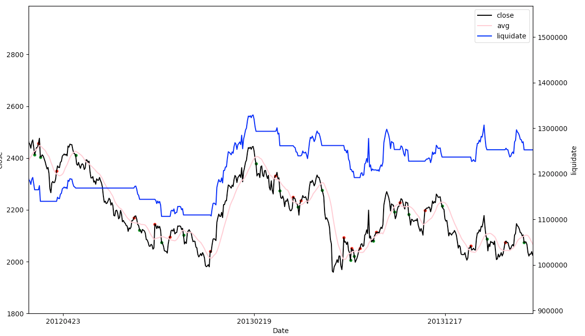

# <跟着小邢老师学python> 第五课 用Python做量化交易策略 画图并导出csv

<a href="https://www.bilibili.com/video/av35982906/" target="_blank">
  
  查看B站视频
</a>

今天我们介绍金融证券经常用到的一个场景 **量化交易**

量化交易涉及到的内容非常多，有不少知识理解起来很有挑战

我们还是以核心概念理解为主，暂时忽略复杂而不关键的部分细节

## 目标
- 从上交所抓取近2000天的上证指数
- 整理成为一个矩阵，方便加工
- 量化分析数据并生成一个交易策略
- 回归测试，计算出策略对应的收益
- 画出价格与资产曲线
- 详细结果导出到csv文件

先看一下最终结果，赚了不少钱，哈哈



## 从上交所抓取近2000天的上证指数
### 分析
我们先在上交所 http://www.sse.com.cn/market/price/trends/ 的页面上查看

通过打开控制台，刷新页面后，注意到了真实的数据地址， 如下所示

```
http://yunhq.sse.com.cn:32041/v1/sh1/dayk/000001?callback=jQuery111205234775875526079_1542185571865&select=date%2Copen%2Chigh%2Clow%2Cclose%2Cvolume&begin=-2000&end=-1&_=1542185571881
```

这里面重要数据在`kline`里面，简单列一些如下(去掉了外层的jQuery，只保留json数据)

```javascript
{
    begin: 6525,
    code: "000001",
    end: 6824,
    kline: [
        [20170823, 3283.796, 3299.457, 3274.44, 3287.704, 179832208],
        [20170824, 3287.959, 3297.988, 3266.358, 3271.511, 163468937],
        ...
    ]
}
```

每一项对应的意义分别是

- 20170823 第一项表示交易日期
- 3283.796 第二项表示开盘价
- 3299.457 第三项表示收盘价
- 3274.440 第四项表示最高价
- 3287.704 第五项表示最低价
- 179832208 最后是成交量

### 爬虫代码

```python
# 引入相关的包
import json # 处理json格式的数据
import requests # 发起网络请求

def run():
    ''' 主程序, 用来调度各个重要流程 '''
    kline = load_sse()
    print(kline)

def load_sse():
    ''' 获取上交所的上证指数K线, 最近2000个交易日数据 '''
    response = requests.get(
        'http://yunhq.sse.com.cn:32041/v1/sh1/dayk/000001?callback=jQuery111205234775875526079_1542185571865&select=date%2Copen%2Chigh%2Clow%2Cclose%2Cvolume&begin=-2000&end=-1&_=1542185571881',
        headers={'Referer': 'http://www.sse.com.cn/market/price/trends/'}
    )

    # 针对结果进行格式处理
    json_str = response.text[42:-1]
    data = json.loads(json_str)
    return data['kline']

if __name__ == '__main__':
    run()
```
有好几点需要注意

- 这里只是贴的代码片段，只是方便大家理解，如果要执行，需要使用最后的完整程序
- 这里面的 def 是用来定义函数的，因为我们的程序比较复杂，所以按函数分成不同功能，方便阅读与维护
- 上面这些函数只是定义，不执行，在最后两行，才是真正执行的，先理解到这一层
- 每个函数里面的第一行，可以通过三个单引号来说明函数的作用，也是一种注释

网络请求的知识，前几节已经讲的比较多了，如果有问题可以翻看一下前面的内容

## 整理成为一个矩阵，方便加工
```python
import pandas as pd # 优秀的分析数据工具

def init_df(kline):
    ''' 根据K线数据，创建含有日期与收盘价的矩阵 '''
    df = pd.DataFrame({})
    df['date'] =  [x[0] for x in kline]
    df['close'] = [x[2] for x in kline]

    return df
```

我们引入了pandas库，他非常强大，用于处理数据

我们先看 `[x[0] for x in kline]` 的作用

这是快速提取数据某些元素的方式， kline里面有很多条数据，我们把每条数据的第一项，也就是交易日期提取出来，成为列表

第三项是收盘价，也是我们这次分析最重要的数据

这样创建的`data_frame`简称`df`就是一个矩阵，可以理解成如下内容
```
       date  close
0  20170101    777
1  20170102    888
```

通过df，我们可以很方便操作里面的数据

## 量化分析数据并生成一个交易策略
```python
def strategy(df):
    ''' 根据价格计算平均值，然后把策略记录下来 '''

    # 连续15天数据，计算平均值，作为当天的平均价格指标
    window_size = 15
    df['avg'] = df['close'].rolling(window_size).apply(lambda x: sum(x) / len(x), raw=True)

    def avg_buy(x):
        ''' 做多策略 '''
        # 这里应该是追涨杀跌的策略，我在视频里说的类似低建高平策略，视频说的是错的
        # 写代码的时候改过几次，后来没改注释，导致视频说错了
        # 不过具体策略不影响我们程序的学习，大家注意到就好了
        min_percent = 0.995
        max_percent = 1.005
        # 追涨，当我们的价格超过了均线一定程度时
        if (x[1] / x[0]) < min_percent:
            return 'open buy'
        # 杀跌，当我们的价格低于均线一定程度时
        if (x[1] / x[0]) > max_percent:
            return 'close buy'
        # 其他情况不操作
        return 'wait'

    df['action'] = df[['close', 'avg']].apply(avg_buy, axis=1)
    return df
```

rolling那一行的整体意思是计算最近15天的平均收盘价，我们拆分来看

- `lambda x: sum(x) / len(x)`是一个简写的函数，这里的x是指一系列数字，这个函数用于计算平均值， sum是求和，len是求总数
- `df['close'].rolling(window_size)` 是把收盘价按连续15个的方式，依次进行处理，类似很多人排队从一个大窗口走过， 这个窗口同时可以看到15个人，每走一个人我们就拍一下照片，得到了一个相册
- `apply(求平均函数, raw=True)` 的意思是把每张照片交给求平均函数，每次产生一个平均数，最终产生一组结果

这样就得到了每天对应的15日平均收盘价，保存到 `df['avg']` 方便后面使用

`avg_buy(x)`也是一个函数，根据传入的数据进行处理，而`df[['close', 'avg']].apply(avg_buy, axis=1)`正是把每天的收盘价与平均价传入了函数中， 这里的`axis=1`的原理非常复杂，我们只要知道，写上这个就能按照一天一天的交易日处理就行。

如果你对axis详细原理很感兴趣，可以单独找我，涉及到高级维度方面的数学知识，我已经弄明白了，愿意讨论分析

在`avg_buy`里面，`x[0]`表示当天收盘价， `x[1]`表示当天平均价

### 策略
我们把他们进行比较，如果收盘价超过均线一定比例，我们就买股票，追涨

如果收盘价跌过均线一定比例，就卖掉股票，杀跌

请注意视频中的说明是错误的，文字版这里的解释才是正确的

### 真实的交易细节相关
理论上是不可能收盘时买股票的，所以我们这里的收盘价可以认为是接近收盘的5分钟内的价格，这时候买入跟收盘价比较接近。我们所有统计也基于这样的收盘价，并不影响策略与收益

我在代码注释里用的术语是 `开多仓 开空仓 平多仓 平空仓` 这样更接近通用的表达，因为A股虽然不能做空，但其他金融产品是可以的，策略也是类似

### 风险提示
> 股市有风险 投资需谨慎

这个策略其实是非常简单的，只是用来演示，请不要根据这个进行投资，无法保证任何收益，切记

## 回归测试，计算出策略对应的收益
```python
def backtest(df):
    ''' 回归测试 '''
    global shares, cash
    amount = 1000000
    shares = 0
    cash = amount

    def run_strategy(row):
        ''' 把每天的数据执行策略 '''
        global shares, cash
        action = row['action']
        close = row['close']

        # 资产 = 现金 + 股票价值
        liquidate = cash + shares * close
        message = 'nothing'

        # 策略要求开仓做多，而且当前空仓时，做多
        if action == 'open buy' and shares == 0:
            shares = int(cash / close)
            cash -= shares * close
            message = 'open buy ' + str(shares)

        # 策略要求平仓，而且当前有仓时，平掉
        if action == 'close buy' and shares > 0:
            message = 'close buy ' + str(shares)
            cash += shares * close
            shares = 0

        return [message, shares, cash, liquidate]

    rows = df[['close', 'action']].apply(run_strategy, axis=1)
    df['message'], df['shares'], df['cash'], df['liquidate'] = zip(*rows)
    return df
```

这里的作用，就是执行策略，计算持股，资产，现金等数据

流程介绍(不含复杂语法)
- 先定义了`share：持股数量` `cash：当前现金` `amount：初始资金100万`
- `run_strategy`接收一天的数据， 根据收盘价与持股数量及现金，计算最新的资产，因为买入或者卖出都不影响当天的资产了，所以可以先计算好
- 策略要求做多而且没有持股的时候，就用现金买入股票，这里为了方便，相当于上证指数也是一个股票，而且我们可以不按整手买入
- 平仓就是卖掉股票，所以持股减少而现金增加
- 最终把几条信息整理返回
- 外层使用 `apply`后得到了多行数据
- 然后记录到不同地方，形成了`message：交易信息` 及其他几项数据

复杂点解释，可以不用深究
- 因为这里是在函数内，backtest 与 run_strategy 都需要使用global标识才能修改shares cash, 以后我们详细讲闭包与作用域就能了解更多
- 因为我们的`df`是一列一列的，所以通过`zip(*rows)`进行一次转置，如果你学过线性代数的话，应该比较容易想象到，就是行与列的转换
- `axis=1`也是按行处理的意思，跟上一个函数类似


## 画出价格与资产曲线
```python
import numpy as np # 处理数字的工具
import matplotlib.pyplot as plt # 强大的画图工具

def draw(df):
    ''' 画图 '''
    # 创建画板
    fig = plt.figure(figsize=(10, 5))

    # 准备横坐标
    count = df.count()['close']
    index = np.arange(count)

    # 设置横坐标的刻度与显示标签
    limit = 200
    plt.xticks(index[::limit], df['date'][::limit])

    # 收盘价与资产的两套坐标系
    ax_close = plt.gca()
    ax_liquidate = ax_close.twinx()

    # 画收盘价曲线
    ax_close.set(xlabel='Date', ylabel='close')
    l_close, = ax_close.plot(index, df['close'], 'black', label='close')

    # 画资产曲线
    ax_liquidate.set(ylabel = 'liquidate')
    l_liquidate, = ax_liquidate.plot(index, df['liquidate'], 'blue', label='liquidate')

    # 给两条线都提供一个图例说明
    plt.legend(handles=[l_close, l_liquidate])
    plt.show()
```

其实不用画图，我们的量化交易也做完了，画出图可以让我们更好地分析

本课不详细介绍画图流程了，希望大家把重点放在数据处理上，后面我们会详细讲画图

注意， 我在视频教程中用的是旧版，最新的我已经加入了均线与买入点，卖出点，请注意

## 详细结果导出到csv文件
```python
df.to_csv('./result.csv', index = False)
```

pandas用来处理数据很方便，导出到csv也就是这一行代码

可以在你的python文件同目录下找到csv

## 量化交易补充
> 股市有风险 投资需谨慎

虽然这个示例程序的演示效果赚了不少钱，但一定不要用于真正的投资，这一点再次强调

另外，我们做量化交易的时候，其实需要经常调整参数，好的策略也要配合好的参数，本例中的15天均值，`0.995 1.005`等策略用到的比例，都是很重要的参数，需要不断调试才能确定

至此，我们的最简单版本量化交易程序就实现了

还有很多功能可以加进来， 也算是策略的优化

当然，具体策略取决于你对证券的理解，我列一些思路

- 支持做空
- 把现金分成多份来投资，不要全仓操作
- 一天内的短线策略
- 多个股票组合
- 将交易量加入策略考虑因素
- 配合消息面的文本分析

如果你有好的建议，我们可以讨论更多策略

## 完整代码
```python
# lesson5.py
# 最简单的量化交易及可视化图

# 引入相关的包
# 如果本地环境没有，需要先安装
# pip install pandas
# pip install numpy
# pip install matplotlib
import json # 处理json格式的数据
import requests # 发起网络请求
import pandas as pd # 优秀的分析数据工具
import numpy as np # 处理数字的工具
import matplotlib.pyplot as plt # 强大的画图工具

def run():
    ''' 主程序, 用来调度各个重要流程 '''
    kline = load_sse()
    df = init_df(kline)
    df = strategy(df)
    df = backtest(df)
    draw(df)
    df.to_csv('./result.csv', index = False)

def load_sse():
    ''' 获取上交所的上证指数K线, 最近2000个交易日数据 '''
    response = requests.get(
        'http://yunhq.sse.com.cn:32041/v1/sh1/dayk/000001?callback=jQuery111205234775875526079_1542185571865&select=date%2Copen%2Chigh%2Clow%2Cclose%2Cvolume&begin=-2000&end=-1&_=1542185571881',
        headers={'Referer': 'http://www.sse.com.cn/market/price/trends/'}
    )

    # 针对结果进行格式处理
    json_str = response.text[42:-1]
    data = json.loads(json_str)
    return data['kline']

def init_df(kline):
    ''' 根据K线数据，创建含有日期与收盘价的矩阵 '''
    df = pd.DataFrame({})
    df['date'] =  [x[0] for x in kline]
    df['close'] = [x[2] for x in kline]

    return df

def strategy(df):
    ''' 根据价格计算平均值，然后把策略记录下来 '''

    # 连续15天数据，计算平均值，作为当天的平均价格指标
    window_size = 15
    df['avg'] = df['close'].rolling(window_size).apply(lambda x: sum(x) / len(x), raw=True)

    def avg_buy(x):
        ''' 做多策略 '''
        # 这里应该是追涨杀跌的策略，我在视频里说的类似低建高平策略，视频说的是错的
        # 写代码的时候改过几次，后来没改注释，导致视频说错了
        # 不过具体策略不影响我们程序的学习，大家注意到就好了
        min_percent = 0.995
        max_percent = 1.005
        # 追涨，当我们的价格超过了均线一定程度时
        if (x[1] / x[0]) < min_percent:
            return 'open buy'
        # 杀跌，当我们的价格低于均线一定程度时
        if (x[1] / x[0]) > max_percent:
            return 'close buy'
        # 其他情况不操作
        return 'wait'

    df['action'] = df[['close', 'avg']].apply(avg_buy, axis=1)
    return df

def backtest(df):
    ''' 回归测试 '''
    global shares, cash
    amount = 1000000
    shares = 0
    cash = amount

    def run_strategy(row):
        ''' 把每天的数据执行策略 '''
        global shares, cash
        action = row['action']
        close = row['close']

        # 资产 = 现金 + 股票价值
        liquidate = cash + shares * close
        message = 'nothing'

        # 策略要求开仓做多，而且当前空仓时，做多
        if action == 'open buy' and shares == 0:
            shares = int(cash / close)
            cash -= shares * close
            message = 'open buy ' + str(shares)

        # 策略要求平仓，而且当前有仓时，平掉
        if action == 'close buy' and shares > 0:
            message = 'close buy ' + str(shares)
            cash += shares * close
            shares = 0

        return [message, shares, cash, liquidate]

    rows = df[['close', 'action']].apply(run_strategy, axis=1)
    df['message'], df['shares'], df['cash'], df['liquidate'] = zip(*rows)
    return df

def draw(df):
    ''' 画图 '''
    # 创建画板
    fig = plt.figure(figsize=(10, 5))

    # 准备横坐标
    count = df.count()['close']
    index = np.arange(count)
    df['index'] = index

    # 设置横坐标的刻度与显示标签
    limit = 200
    plt.xticks(index[::limit], df['date'][::limit])

    # 收盘价与资产的两套坐标系
    ax_close = plt.gca()
    ax_liquidate = ax_close.twinx()

    # 画收盘价曲线
    ax_close.set(xlabel='Date', ylabel='close')
    l_close, = ax_close.plot(index, df['close'], 'black', label='close')
    l_avg, = ax_close.plot(index, df['avg'], 'pink', label='avg')

    # 画资产曲线
    ax_liquidate.set(ylabel = 'liquidate')
    l_liquidate, = ax_liquidate.plot(index, df['liquidate'], 'blue', label='liquidate')

    def drawAction(row):
        if row['message'] == 'nothing':
            return

        color = ''
        marker = 'o'
        size = 12

        if row['action'] == 'open buy':
            color='r'
        if row['action'] == 'close buy':
            color='g'

        ax_close.scatter(row['index'], row['close'], s=size, color=color, zorder=2, marker=marker)

    df[['index', 'action', 'message', 'close']].apply(drawAction, axis=1)

    # 给两条线都提供一个图例说明
    plt.legend(handles=[l_close, l_avg, l_liquidate])
    plt.show()

if __name__ == '__main__':
    run()
```
