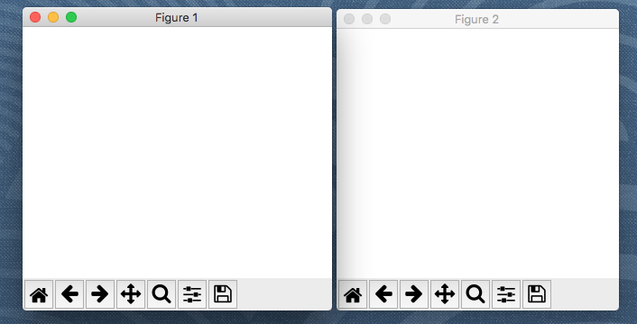
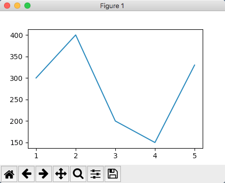
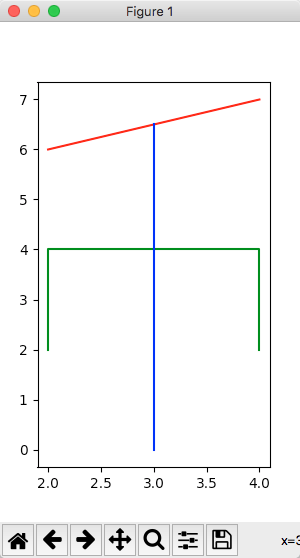
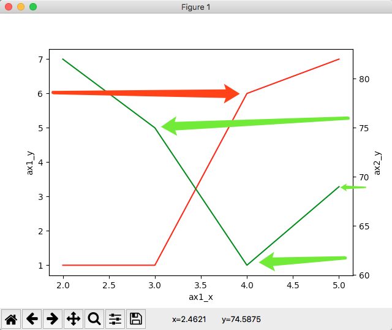
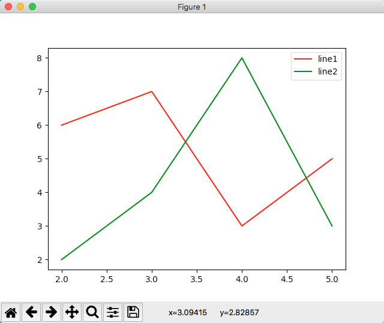
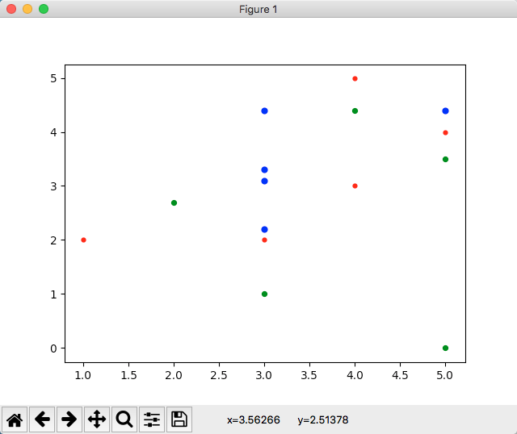
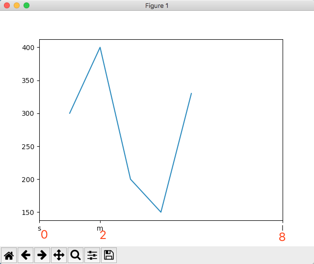

# <跟着小邢老师学python> 第六课 使用matplotlib画图

上一课我们介绍了量化交易策略,在程序里也体现了画图的代码,并没有讲解

今天就详细介绍画图相关的知识点

## pyplot
我们使用的画图工具是`matplotlib`里面的`pyplot`,可以在 [https://matplotlib.org/index.html](https://matplotlib.org/index.html) 查看详细内容

这个工具可以做非常强大的画图相关的事情, 在[https://matplotlib.org/gallery/index.html](https://matplotlib.org/gallery/index.html) 可以看到上百个优秀示例

今天我们主要了解的是基于坐标系,画曲线的部分

## 基本概念

我们先看一下上节课的图片


这里面有几个概念

- 坐标系
    - 横轴
        - 名称
        - 刻度
    - 纵轴
    - 第二纵轴
- 曲线
    - 数据
    - 颜色
    - 图例
    - 标识圆点

还有一个概念就是这个图本身

对这些概念有了初步认识,学习后面的代码就容易很多,因为程序代码其实就是对事物的模拟实现,要概念上是对应的

## figure
figure是几何图形,图案的意思, 在pyplot中,想画图需要先创建一个figure, 我们也可以理解为一个画板

注意:不创建画板直接画图也是可以的,相当于默认创建了一个画板

```python
import matplotlib.pyplot as plt # 起一个别名,方便使用

fig1 = plt.figure()
fig2 = plt.figure()
plt.show()
```




这样,我们就创建了两个空白的figure, 在程序中经常简写做`fig`

最后一句`show`的作用,是把所有图都展示出来

## plot
plot当作动词,是在地图上绘制的意思, 在坐标系中提借一系列的点, 连起来就形成一条线

```python
import matplotlib.pyplot as plt
plt.plot([1, 2, 3, 4, 5], [300, 400, 200, 150, 330])
plt.show()
```


我们把每一个点的横坐标的数组与每一个点的纵坐标组成的数据交给plot, 就可以画出这条线了

默认情况下, 坐标系会根据我们提供的数据进行适配,非常方便


接下来,我们画不一样颜色的几条线, 我们研究经济领域, 就画一个货币的`币`
```python
import matplotlib.pyplot as plt
fig = plt.figure(figsize=(3, 5))
plt.plot([2, 4], [6, 7], 'red')
plt.plot([2, 2, 4, 4], [2, 4, 4, 2], 'green')
plt.plot([3, 3], [0, 6.5], 'blue')
plt.show()
```



## axes
坐标系是绘图很重要的概念, 我们上面的例子都是使用默认的自适应坐标系

```python
import matplotlib.pyplot as plt
ax1 = plt.gca() # get current axes
ax2 = ax1.twinx()

ax1.set(xlabel='ax1_x', ylabel='ax1_y')
ax2.set(xlabel='ax2_x', ylabel='ax2_y')

ax1.plot([2, 3, 4, 5], [1, 1, 6, 7], 'red')
ax2.plot([2, 3, 4, 5], [82, 75, 61, 69], 'green')

plt.show()
```



两条线对应的坐标系不一样, 红线对的是左边的坐标系,绿线对应的是右边的坐标系

## legend
有时候画的线多了, 需要进行说明

```python
import matplotlib.pyplot as plt
fig = plt.figure()
l1, = plt.plot([2, 3, 4, 5], [6, 7, 3, 5], 'red', label='line1')
l2, = plt.plot([2, 3, 4, 5], [2, 4, 8, 3], 'green', label='line2')
plt.legend(handles=[l1, l2])
plt.show()
```



需要注意, 画线的时候要填写`label`参数,给这条线进行命名

而且plot方法支持画多条线,所以得到的结果带数据赋值的时候,需要进行一次解构

```python
a, b = ['apple', 'banana']
print(a)
print(b)

c, = ['cool']
print(c)
```

这里c的值是`cool`字符串,如果没有那个逗号做解构的话, c的值就是数组了

注意:数组里面的数量一定要跟等号左边的变量数量一致,否则就会报错

## scatter
散点, 用来在画板上画一些点, 不会把各个点进行连线的

```python
import matplotlib.pyplot as plt
plt.scatter([1, 3, 4, 4, 5], [2, 2, 3, 5, 4], s=12, color='r')
plt.scatter([3, 5, 2, 4, 5], [1, 3.5, 2.7, 4.4, 0], s=18, color='g')
plt.scatter([3, 3, 3, 3, 5], [2.2, 3.1, 3.3, 4.4, 4.4], s=24, color='b')
plt.show()
```



数据部分依然是标坐标的集合,纵坐标的集合

- s表示散点的尺寸
- color里面的`r g b`分别表示红绿蓝

## ticks
坐标上的刻度是自动提供的,有时候希望能手动控制多长一个刻度,而且可以调整显示的文字

```python
import matplotlib.pyplot as plt
plt.plot([1, 2, 3, 4, 5], [300, 400, 200, 150, 330])
plt.xticks([0, 2, 8], ['s', 'm', 'l'])
plt.show()
```



刻度已经换成我们设置的了,而且显示的不再是数字,而是提供好的label

这里红色的数字是我后期画图加上的注释

## 更多
matplotlib还有很多好用的工具, 而且本课的例子也有很多细节没讲到

大家有什么画图方面的需求, 不太清楚如何实现, 或者希望我再多讲哪些画图方面的功能, 欢迎留言讨论