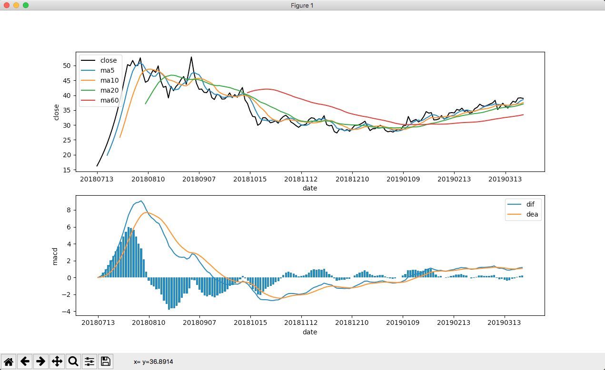

# <跟着小邢老师学python> 第七课 股票的macd曲线是如何画出来的

<a href="https://www.bilibili.com/video/av0000000/" target="_blank">
  
  查看B站视频
</a>

股票技术术语中有很多重要的指标,例如 `ma` `macd` `kdj` `rsi` 等

接下来, 介绍如何构造 `ma` 与 `macd`这两个指标

为避免现金分红带来的影响, 我们以未分红过的新股为例进行演示

## 目标
- 抓取数据
- 计算ma指标
- 计算macd指标
- 简单画图展示

先看一下最终效果



## 抓取数据

从上交所抓取某个未分红过的新股

***请注意该教程仅做教学演示, 不做任何个股分析***

因为抓取数据的过程在第五课已经讲过, 这里仅提供代码, 不再重复讲解

这些的代码只是一个函数, 无法直接运行, 如果想亲自测试, 请使用最后提供的完整代码

```python
def download():
    response = requests.get(
        'http://yunhq.sse.com.cn:32041/v1/sh1/dayk/603713?callback=jQuery111205234775875526079_1542185571865&select=date%2Copen%2Chigh%2Clow%2Cclose%2Cvolume&begin=-5000&end=-1&_=1542185571881',
        headers={'Referer': 'http://www.sse.com.cn/market/price/trends/'}
    )

    # 针对结果进行格式处理
    json_str = response.text[42:-1]
    data = json.loads(json_str)
    return data['kline']

def init_df(kline):
    ''' 根据K线数据，创建含有日期与收盘价的矩阵 '''
    df = pd.DataFrame({})
    df['date'] =  [x[0] for x in kline]
    df['close'] = [x[4] for x in kline]

    return df
```

## 计算ma指标
### ma指标的概念与分析

[百度百科](https://baike.baidu.com/item/MA%E6%8C%87%E6%A0%87/10230874)

ma其实就是 Moving average, 移动平均线

我们需要使用pandas的rolling方法, 获取一定长度的移动窗口, 然后计算其平均值即可

如果我们有一系列数据, 只要计算出总和与长度, 做除法就是平均值

```python
# 一系列数字
prices = [5, 8, 4, 3]
# 5 + 8 + 4 + 3 = 20
# 20 / 4 = 5
average = sum(prices) / len(prices)
```

获取移动窗口时, 需要提供窗口大小

```python
df['close'].rolling(5).apply(lambda x: sum(x) / len(x))
```

这里的rolling中的5就是窗口大小,说明要以连续的5条数据作为一个移动窗口

每次会把5个数字作为一个数组, 交给apply, 在apply中通过一个函数接收并处理

在python中使用lambda表达式可以很方便地写函数, 这里的x就是这个数组, 冒号后面就是要返回的数据

### 生成多个ma指标
因为ma有窗口周期的概念, 一般都以 5 10 20 60 作为几个重要的窗口周期, 因为分别代表了 一周, 半月, 一月, 一季

所以我们循环生成这些ma指标

```python
def ma_lines(df, windows):
    for window in windows:
        name = 'ma%s' % (window)
        df[name] = df['close'].rolling(window).apply(lambda x: sum(x) / len(x), raw=True)
    return df
```

注意, apply是最万能的办法,可以实现自己的任意需求, 如果为了简单, 也可以使用mean实现, 效果一样
```python
df[name] = df['close'].rolling(window).mean()
```

## 计算macd指标
### macd指标的概念与分析
`平滑异同移动平均线 (Moving Average Convergence Divergence)`
[百度百科](https://baike.baidu.com/item/MACD%E6%8C%87%E6%A0%87/6271283)
[智库百科](https://wiki.mbalib.com/wiki/MACD)

`指数移动平均数指标(Exponential Moving Average，EXPMA或EMA)`
[智库百科](https://wiki.mbalib.com/wiki/EMA)

EMA ＝（当日收盘价－上日EMA）／N＋上日EMA

***macd的概念很清晰, 但是有很多不同的说法***

本教程采用的说法与概念的对应关系如下
- `短期ema` ema(close, 12)
- `长期ema` ema(close, 26)
- `离差值` dif = ema(close, 12) - ema(close, 26)
- `离差平均值` dea = ema(dif, 9)
- `柱` histogram = (dif - dea) * 2

### 不同说法的介绍
`快速/慢速/短期/长期`

因为ema(close,12)比ema(close, 26)的变化要快, dif比dea的变化也要快, 所以有些地方会混淆`快`与`短`, `慢`与`长`

只说快速线,很难知道是ema(close, 12) 还是dif

`macd到底是谁`
- 因为dif是macd指标的核心, 所以有时候也叫dif为macd
- 因为有时候不体现histogram的命名, 所以也叫 histogram 为macd
- 因为有时候dea的说法比较不稳定, 所以也会叫 dea为macd
- 本文认为macd是一个整体概念,不是哪条线

`dea的别名`
- 因为dea是在diff基础上生成的, 有一定的辅助作用,有时候也叫signal
- 也有人把dea叫作 dem, macd

`histogram的别名`
- 因为是一个柱形, 像一个长条, 有时候也叫bar
- 因为也体现了一定的信号, 有时候也叫signal
- 很多成熟的网站又把histogram叫作macd

### 不同公式与参数
不只是说法不统一, 计算ema初值与 histogram的公式也不统一

***ema初值***
- 方法1 使用第一个收盘价
- 方法2 前几天的收盘价平均值
- 方法3 (H+L+2C)/4
- 方法4 迭代平滑因子,从1不断接近设定的alpah
此处采用最简单与常见的方法1

***重要参数***
12 26 9这几个参数是在追踪经验上发现比较合适的, 也是最主流的用法

***2倍的 dif - dea***
按理说, 差值已经体现了两条线的关系, 不需要再乘以2

不过, 很多地方都约定俗成, 乘以2来放大差距,方便观察

### 生成指标的代码细节
如何生成ema指标

直接使用pandas提供的ewm
```python
def ema_lines(df, from_label, N):
    line = df[from_label].ewm(alpha=2/(N+1), adjust=False).mean()

    # 为了与多数平台保持一致,保留3位小数
    return round(line, 3)
```

生成macd的指标们
```python
def macd_lines(df):
    df['ema12'] = ema_lines(df, 'close', 12)
    df['ema26'] = ema_lines(df, 'close', 26)
    df['dif'] = df['ema12'] - df['ema26']
    df['dea'] = ema_lines(df, 'dif', 9)

    df['histogram'] = (df['dif'] - df['dea']) * 2
    return df
```


## 简单画图展示
这一步的实现细节不是关键, 参考最后的代码即可

## 完整代码
```python
# 股票的各种指标
# macd
#   http://www.forexabode.com/forex-school/technical-indicators/macd/
# 有些股票涉及到分红, 价格变成了负数
import os # 操作系统库
import json # 处理json格式的数据
import requests # 发起网络请求
import pandas as pd # 优秀的分析数据工具
import numpy as np # 处理数字的工具
import matplotlib.pyplot as plt # 强大的画图工具

def run():
    ''' 主程序, 用来调度各个重要流程 '''
    print('正在下载')
    kline = download()
    df = init_df(kline)

    windows = [5, 10, 20, 60]
    df = ma_lines(df, windows)
    df = macd_lines(df)

    draw(df, windows)
    df.to_csv('lesson7.csv', index=False)

def download():
    response = requests.get(
        'http://yunhq.sse.com.cn:32041/v1/sh1/dayk/603713?callback=jQuery111205234775875526079_1542185571865&select=date%2Copen%2Chigh%2Clow%2Cclose%2Cvolume&begin=-5000&end=-1&_=1542185571881',
        headers={'Referer': 'http://www.sse.com.cn/market/price/trends/'}
    )

    # 针对结果进行格式处理
    json_str = response.text[42:-1]
    data = json.loads(json_str)
    return data['kline']

def init_df(kline):
    ''' 根据K线数据，创建含有日期与收盘价的矩阵 '''
    df = pd.DataFrame({})
    df['date'] =  [x[0] for x in kline]
    df['close'] = [x[4] for x in kline]

    return df

def ma_lines(df, windows):
    for window in windows:
        name = 'ma%s' % (window)
        df[name] = df['close'].rolling(window).apply(lambda x: sum(x) / len(x), raw=True)
    return df

def macd_lines(df):
    df['ema12'] = ema_lines(df, 'close', 12)
    df['ema26'] = ema_lines(df, 'close', 26)
    df['dif'] = df['ema12'] - df['ema26']
    df['dea'] = ema_lines(df, 'dif', 9)

    df['histogram'] = (df['dif'] - df['dea']) * 2
    return df

def ema_lines(df, from_label, N):
    line = df[from_label].ewm(alpha=2/(N+1), adjust=False).mean()

    # 为了与多数平台保持一致,保留3位小数
    return round(line, 3)

def draw(df, windows):
    ''' 画图 '''
    # 创建画板
    plt.figure(figsize=(7, 4))

    # 准备横坐标
    count = df.count()['close']
    index = np.arange(count)
    df['index'] = index

    # 设置横坐标的刻度与显示标签
    limit = 20
    plt.subplot(211)
    plt.xticks(index[::limit], df['date'][::limit])

    # 画收盘价曲线
    plt.xlabel('date')
    plt.ylabel('close')
    l_close, = plt.plot(index, df['close'], 'black', label='close')
    legend_handles_close = [l_close]

    for window in windows:
        name = 'ma%s' % (window)
        l_ma, = plt.plot(index, df[name], label=name)
        legend_handles_close.append(l_ma)
    plt.legend(handles=legend_handles_close)

    plt.subplot(212)
    plt.xticks(index[::limit], df['date'][::limit])

    plt.xlabel('date')
    plt.ylabel('macd')
    macd_labels = ['ema12', 'ema26', 'dif', 'dea', 'histogram']
    l_dif, = plt.plot(index, df['dif'], label='dif')
    l_dea, = plt.plot(index, df['dea'], label='dea')
    plt.bar(index, df['histogram'])
    legend_handles_macd = [l_dif, l_dea]

    plt.legend(handles=legend_handles_macd)
    plt.show()

if __name__ == '__main__':
    run()
```


